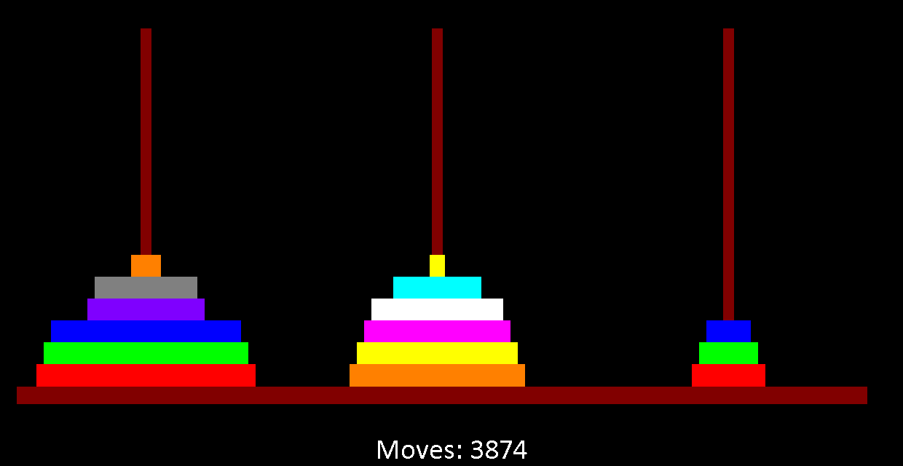

# Towers of Hanoi

A solver for Towers of Hanoi written in highschool using C++/Allegro. Can theoretically solve with any number of disks (as long as it doesn't go over the maximum integer size in C++, I guess) given enough time.

## Installation

Requires Allegro for compilation

## Credits

Code and graphics by Nicholas Sunderland, 2015
